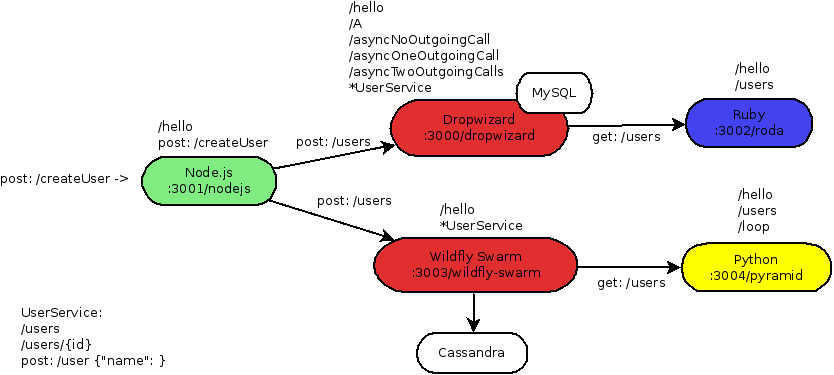
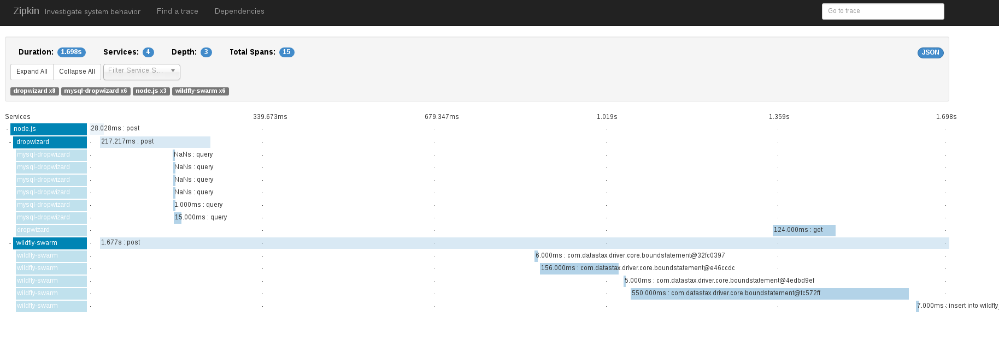

= Example Polyglot Application

Example applications demonstrating polyglot environment instrumented with zipkin instrumentation libraries.

[[architecture]]

Architecture diagram shows dependencies between services. The whole environment
can be executed with docker-compose. Some of the services can be used in standalone mode, however some
of the endpoints might not work as they are calling external services. Feel free to experiment and add new endpoints or
services.

== Run
[source,shell]
----
$ export TRACING_SERVER=172.17.0.1
$ export TRACING_PORT=8080
$ docker-compose pull
$ docker-compose up
$ docker-compose down -> stop and remove

-> Run tracing server (Hawkular APM or zipkin server). Server has to be started after containers to make sure kafka is running.
-> If using Hawkular APM use /standalone.sh -b 0.0.0.0.
-> Zipkin server has to be started with KAFKA_ZOOKEEPER=172.17.0.1:2181 java -jar zipkin-server.jar
----

* `TRACING_SERVER` - address of tracing server. It cannot be localhost,
                     therefore bind tracing server to 0.0.0.0 address or 172.17.0.1 (docker0 interface).
* `TRACING_PORT` - port of the tracing server. Hawkular APM 8080 or zipkin 9411.

== Example requests
[source,shell]
----
$ curl -ivX GET 'http://localhost:3001/nodejs/hello'
$ curl -ivX GET 'http://localhost:3000/dropwizard/hello'
$ curl -ivX GET 'http://localhost:3003/wildfly-swarm/hello'
$ curl -ivX GET 'http://localhost:3002/roda/hello'
$ curl -ivX GET 'http://localhost:3004/pyramid/hello'
-> hello calls

$ curl -ivX POST -H 'Content-Type: application/json' 'http://localhost:3001/nodejs/createUser' -d '{"name": "jdoe"}'
-> multi service call for user creation
$ curl -ivX POST -H 'Content-Type: application/json' 'http://localhost:3000/dropwizard/users' -d '{"name": "jdoe"}'
$ curl -ivX GET 'http://localhost:3000/dropwizard/users'
-> create and get users in dropwizard (using MySQL)
$ curl -ivX POST -H 'Content-Type: application/json' 'http://localhost:3003/wildfly-swarm/users' -d '{"name": "jdoe"}'
$ curl -ivX GET 'http://localhost:3003/wildfly-swarm/users'
-> create and get users in wildfly-swarm (using Cassandra)
$ curl -ivX GET 'http://localhost:3000/dropwizard/asyncTwoOutgoingCalls'
-> asynchronous call
$ curl -ivX GET 'http://localhost:3000/dropwizard/A'
-> chaining requests within one service
$ curl -ivX GET 'http://localhost:3004/pyramid/loop'
-> chaining requests within one service
----

== Screenshots

== Known issues
* https://issues.jboss.org/browse/HWKAPM-623[Span from ruby app fail to deserialize in zipkin server]
